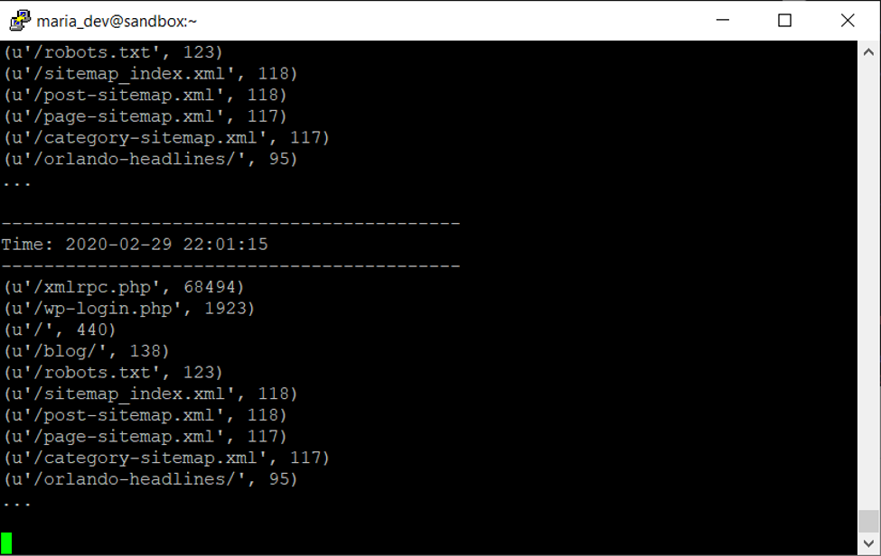
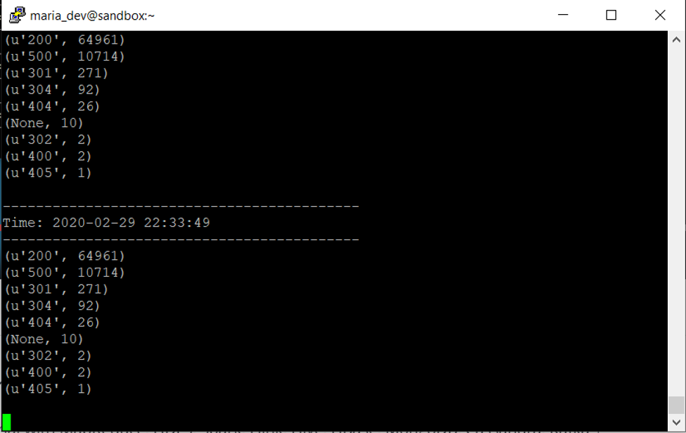
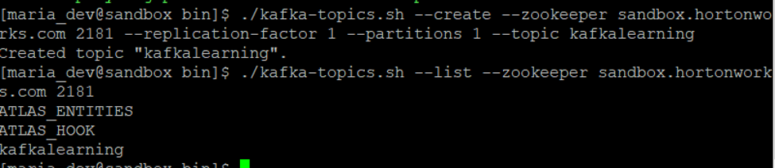
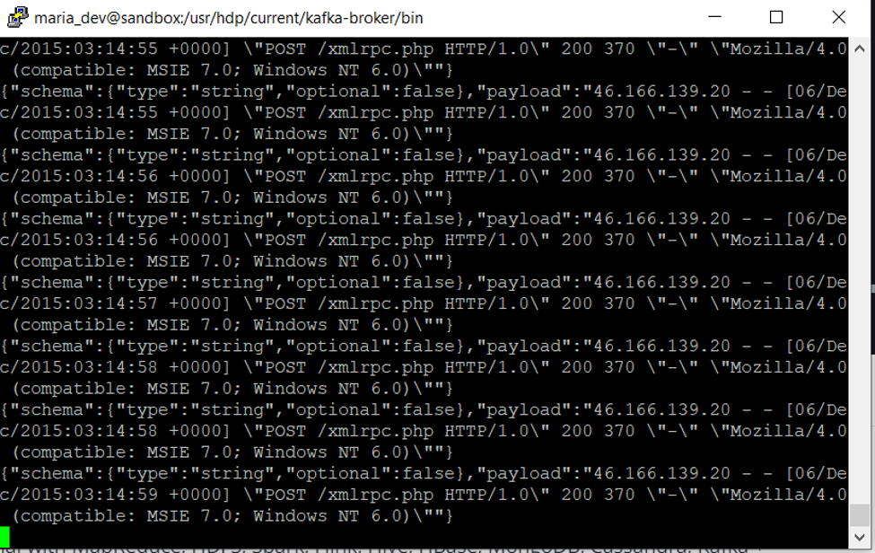

# Log Analysis

Perfomed log analysis of a log file using Spark Streaming. I used Flume to push the data and then did the analysis using Spark. I aslo tried hands on Kafkt to send the data. For this I used Hortonworks Sandbox (HDP) and in that I used the kafka and flume services. 

### About

In this I did analysis, the first in which I got the request URLs and then the statu so those URLs as well. 

### Install

- [Hortonworks Sandbox](https://www.cloudera.com/downloads/hortonworks-sandbox/hdp.html)

### Results

Flume

Kafka

## Contributing
Pull requests are welcome. For major changes, please open an issue first to discuss what you would like to change.

Please make sure to update tests as appropriate.